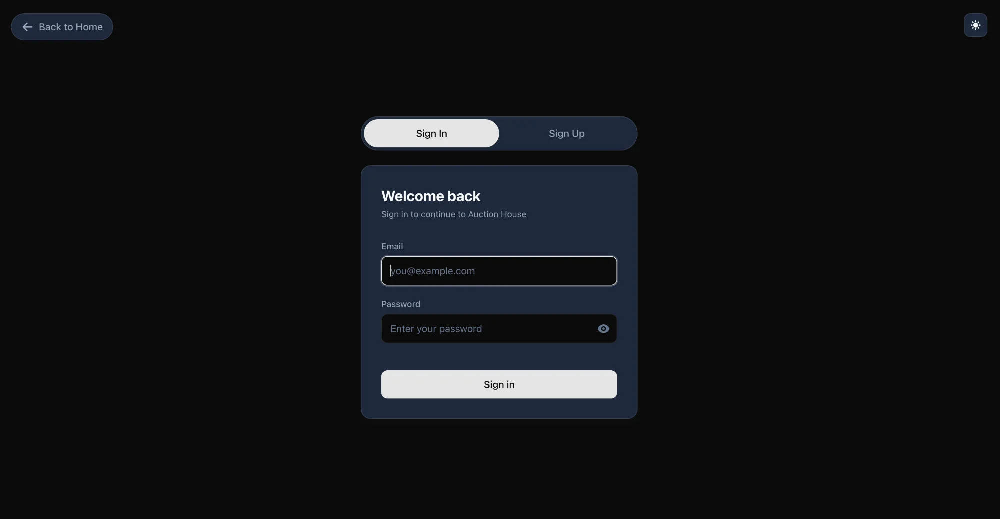
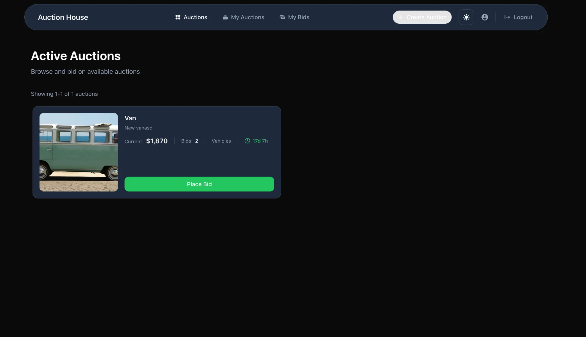
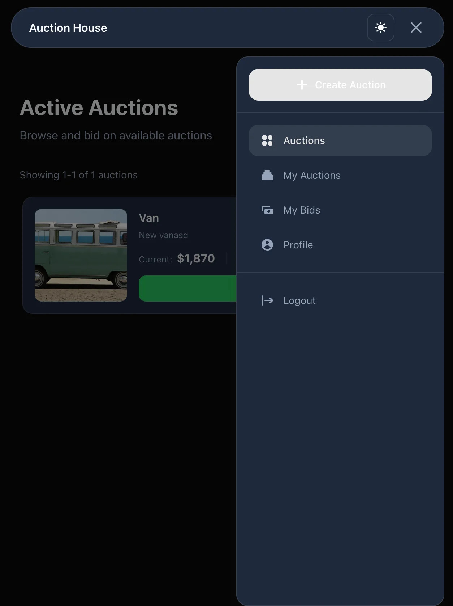
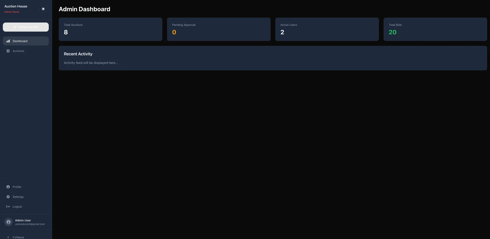
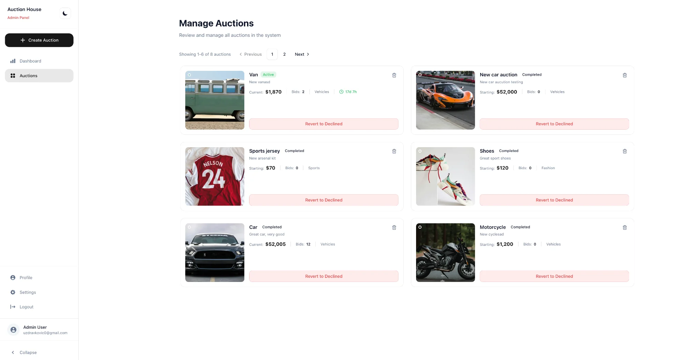
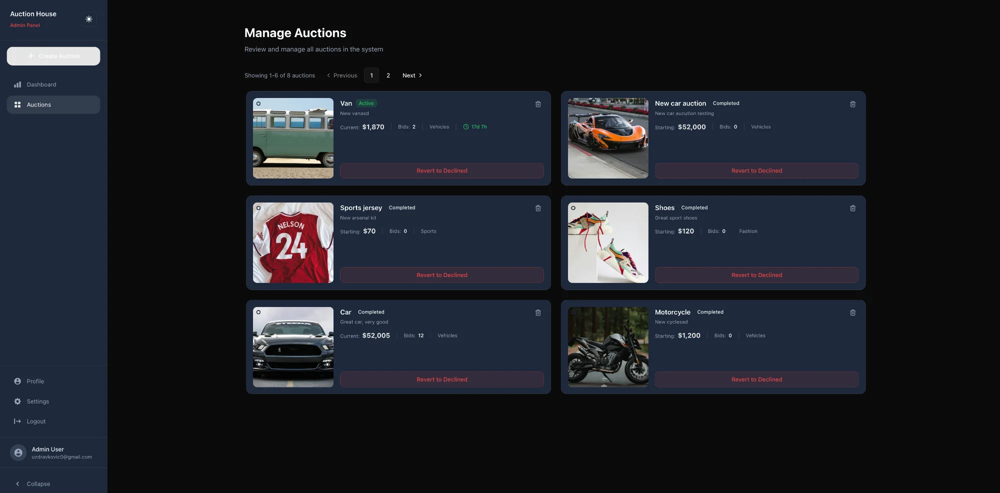
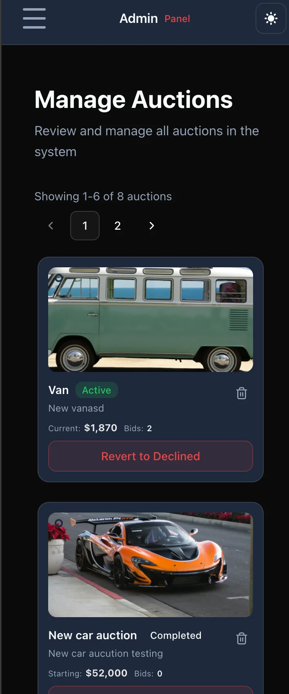
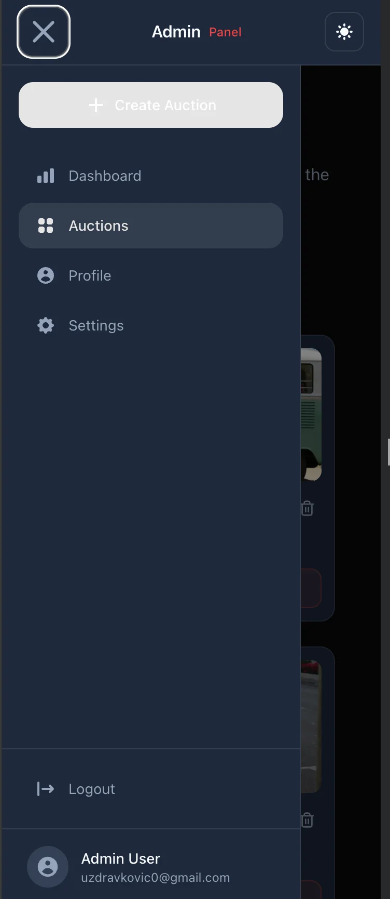

# 🏠 Auction House

A modern, full-featured online auction platform built with React, TypeScript, and Firebase. The application features a complete separation of user and admin interfaces, providing tailored experiences based on user roles.


## ✨ Features

### User Features
- **Browse Auctions** - View all active, approved auctions
- **Place Bids** - Real-time bidding with minimum bid validation
- **Create Auctions** - Submit new auctions for admin approval
- **My Auctions** - Track your own auction listings and their status
- **User Profile** - Manage your account settings

### Admin Features
- **Dashboard** - Overview statistics including total auctions, pending reviews, active users, and total bids
- **Auction Management** - Review, approve, reject, or delete any auction
- **Status Tracking** - See auction status (Pending, Active, Declined, Completed)
- **Related Auctions** - View same-category auctions for context

### Technical Highlights
- **Role-Based Routing** - Completely separate routing for users and admins
- **Real-time Updates** - React Query for efficient data fetching and caching
- **Form Validation** - Zod schema validation with React Hook Form
- **Responsive Design** - Mobile-first design with Tailwind CSS
- **Dark/Light Mode** - Theme toggle support
- **Image Handling** - Multi-image upload with slider display

## 📸 Screenshots

### Authentication

#### Login Page


### User Interface

#### Active Auctions - Desktop
Browse and bid on available auctions with a clean, intuitive interface.



#### User Mobile Navigation
Responsive mobile menu with easy access to all user features.



### Admin Interface

#### Admin Dashboard
Overview of platform statistics with quick access to key metrics.



#### Manage Auctions - Light Mode
Full auction management with status badges, pricing info, and moderation controls.



#### Manage Auctions - Dark Mode
The same powerful interface with dark theme support.



#### Collapsed Sidebar View
Compact sidebar mode for more content space.


#### Admin Mobile View
Full-featured admin panel optimized for mobile devices.



#### Admin Mobile Navigation
Dedicated mobile navigation for admin users with all management options.



## 🏗️ Architecture

### Role-Based View Separation

The core architectural feature is the complete separation of user and admin experiences:

```
src/
├── components/
│   ├── admin/                    # Admin-only components
│   │   ├── auctions/
│   │   │   ├── AdminAuctionCard.tsx
│   │   │   ├── AdminAuctionDetails.tsx
│   │   │   ├── DeleteAuctionDialog.tsx
│   │   │   └── RejectAuctionDialog.tsx
│   │   ├── dashboard/
│   │   │   ├── StatCard.tsx
│   │   │   ├── StatsGrid.tsx
│   │   │   └── RecentActivity.tsx
│   │   └── navigation/
│   │       ├── AdminLayout.tsx
│   │       ├── AdminNavigation.tsx
│   │       └── AdminNavigationMobile.tsx
│   │
│   └── user/                     # User-only components
│       ├── auctions/
│       │   ├── UserAuctionCard.tsx
│       │   └── UserAuctionDetails.tsx
│       └── navigation/
│           ├── UserLayout.tsx
│           ├── UserNavigation.tsx
│           └── UserNavigationMobile.tsx
│
├── pages/
│   ├── admin/
│   │   ├── AdminDashboardPage.tsx
│   │   ├── AdminAuctionsPage.tsx
│   │   └── AdminAuctionDetailsPage.tsx
│   │
│   └── user/
│       ├── AuctionsPage.tsx
│       ├── AuctionDetailsPage.tsx
│       ├── MyAuctionsPage.tsx
│       └── ProfilePage.tsx
│
└── router/
    └── index.tsx                 # Separate routers for each role
```

### How It Works

The application dynamically switches between completely different router configurations based on user role:

```typescript
// App.tsx
const router = userProfile?.role === 'admin' 
  ? createAdminRouter() 
  : createUserRouter();

return <RouterProvider router={router} />;
```

This ensures:
- **Admins** see the dashboard, can manage all auctions, and have moderation controls
- **Users** see only approved auctions, can bid, and manage their own listings

## 🛠️ Tech Stack

| Category | Technology |
|----------|------------|
| Framework | React 19.2 |
| Language | TypeScript 5.9 |
| Styling | Tailwind CSS 4.1 |
| State Management | TanStack React Query 5.90 |
| Forms | React Hook Form + Zod |
| Routing | React Router 7.9 |
| Backend | Firebase (Auth, Firestore, Storage) |
| UI Components | Radix UI Primitives |
| Icons | React Icons, Lucide React |
| Image Slider | Swiper |
| Build Tool | Vite 7.2 |

## 📁 Project Structure

```
src/
├── components/          # Reusable UI components
│   ├── admin/          # Admin-specific components
│   ├── user/           # User-specific components
│   ├── auction/        # Shared auction components
│   ├── authentication/ # Login/Register forms
│   ├── navigation/     # Theme toggle, shared nav
│   └── ui/             # Base UI components (Button, Input, etc.)
│
├── context/            # React Context providers
│   ├── AuthContext.tsx # Authentication state
│   └── ThemeContext.tsx# Theme management
│
├── hooks/              # Custom React hooks
│   ├── useAuth.ts      # Authentication hook
│   ├── useAuctions.ts  # Auction data hooks
│   ├── useAdminActions.ts # Admin-specific hooks
│   ├── useBids.ts      # Bidding hooks
│   └── useDashboardStats.ts # Dashboard statistics
│
├── pages/              # Page components
│   ├── admin/          # Admin pages
│   ├── user/           # User pages
│   └── authentication/ # Auth pages
│
├── services/           # Firebase service functions
│   ├── auctionService.ts
│   ├── bidService.ts
│   ├── storageService.ts
│   └── userService.ts
│
├── types/              # TypeScript type definitions
├── utils/              # Utility functions
├── constants/          # App constants
├── firebase/           # Firebase configuration
└── router/             # Route definitions
```

## 🔐 Security Rules

Recommended Firestore security rules:

```javascript
rules_version = '2';
service cloud.firestore {
  match /databases/{database}/documents {
    // Users can read their own profile
    match /users/{userId} {
      allow read: if request.auth != null;
      allow write: if request.auth.uid == userId;
    }
    
    // Auctions - anyone can read approved, owners can create
    match /auctions/{auctionId} {
      allow read: if resource.data.status == 'approved' 
                  || request.auth.uid == resource.data.ownerId
                  || get(/databases/$(database)/documents/users/$(request.auth.uid)).data.role == 'admin';
      allow create: if request.auth != null;
      allow update: if request.auth.uid == resource.data.ownerId
                    || get(/databases/$(database)/documents/users/$(request.auth.uid)).data.role == 'admin';
      allow delete: if get(/databases/$(database)/documents/users/$(request.auth.uid)).data.role == 'admin';
    }
    
    // Bids - authenticated users can create
    match /bids/{bidId} {
      allow read: if request.auth != null;
      allow create: if request.auth != null && request.auth.uid == request.resource.data.userId;
    }
  }
}
```

## 📜 Available Scripts

| Command | Description |
|---------|-------------|
| `npm run dev` | Start development server |
| `npm run build` | Build for production |
| `npm run preview` | Preview production build |
| `npm run lint` | Run ESLint |

## 🤝 Contributing

1. Fork the repository
2. Create your feature branch (`git checkout -b feature/amazing-feature`)
3. Commit your changes (`git commit -m 'Add some amazing feature'`)
4. Push to the branch (`git push origin feature/amazing-feature`)
5. Open a Pull Request

## 📄 License

This project is licensed under the MIT License.

## 👤 Author

**Uroš Zdravković**

- GitHub: [@UrosZdravkovic](https://github.com/UrosZdravkovic)

---

<p align="center">
  Made with ❤️ using React and Firebase
</p>
